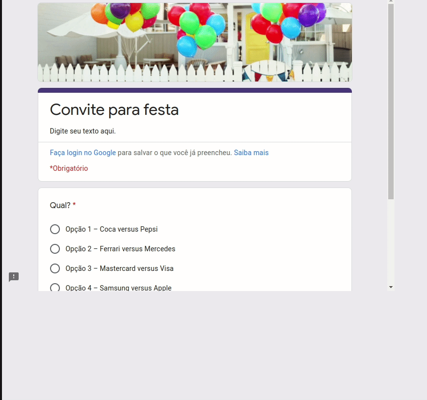
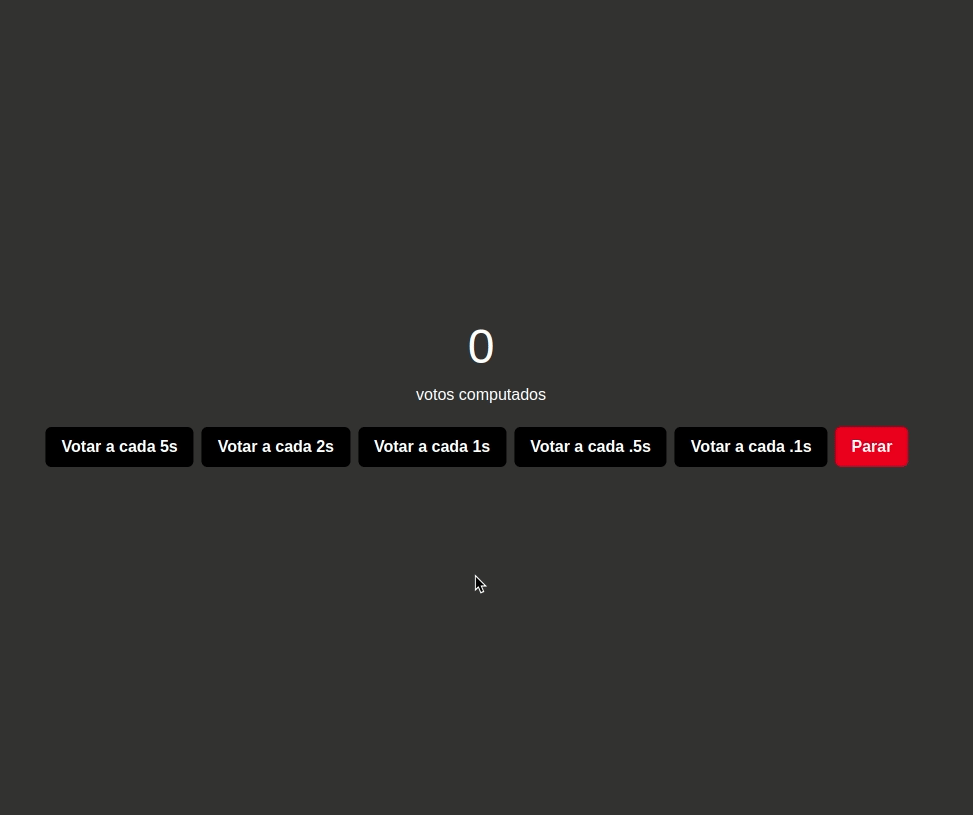
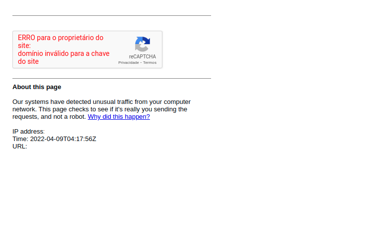

<p align="center">
    
</p>

# Google Form Bot

## Summary

- [Introduction](#introduction)
- [Technologies](#technologies)
- [Specifications](#specifications)
- [First Steps](#first-steps)
- [How to get POST URL](#how-to-get-post-url)
- [Modules](#modules)
  - [Puppeteer](#puppeteer)
  - [CurL](#curl)
  - [Web](#web)
- [Warning](#warning)

## Introduction

This project was created with the purpose to learn more about how bots currently work

## Technologies

- Puppeteer
- CurL
- React

## Specifications

- Ubuntu 20.04
- Node 16.13.1
- Npm 8.1.2

## First Steps

    git clone https://github.com/GGotha/google-form-bot
    cd web
    npm install
    cd puppeteer
    npm install

## How to get POST URL

### Manually

- Get the entry ID
  - You need to inspect the page on developer tools and search 'entry'
    - ex: entry.1135870437
- Get the draftResponse
  - When you select an option, the draftResponse will be given in network section on developer tools
    - ex: [1,null,[[null,null,["Opção 4 – Samsung versus Apple"],false,null,null,1135870437]],null,["-9015358315957581321"]]
- Get the URL https://docs.google.com/forms/d/e/1FAIpQLSdZDiHCztvOE4SOICzZBPAMWfdYnbMm5WVPiHedSjB-6y0Klg/viewform
- Change viewform to formResponse
  - https://docs.google.com/forms/d/e/1FAIpQLSdZDiHCztvOE4SOICzZBPAMWfdYnbMm5WVPiHedSjB-6y0Klg/formResponse
- Put query string inside this URL (axios or insomnia will help in this step)
  - entry.1135870437
    - Set the value with your response
      - ex: Opção 4 – Samsung versus Apple
  - draftResponse
    - ex: [1,null,[[null,null,["Opção 4 – Samsung versus Apple"],false,null,null,1135870437]],null,["-9015358315957581321"]]
- The final URL will be
  - https://docs.google.com/forms/d/e/1FAIpQLScdyjvRkSVja8cuWwFhlg_mc2iz_s6KMkmNFDhC1nz2nSSQfg/formResponse?entry.1100052144=Op%C3%A7%C3%A3o%204%20%E2%80%93%20Samsung%20versus%20Apple&draftResponse=%5B1,null,%5B%5Bnull,null,%5B%22Op%C3%A7%C3%A3o%204%20%E2%80%93%20Samsung%20versus%20Apple%22%5D,false,null,null,1135870437%5D%5D,null,%5B%22-9015358315957581321%22%5D%5D

## Modules

### <b>Puppeteer</b>

Puppeteer is a technology popular on E2E tests and it's great tool to work with bots



#### Pros

- User Interface

#### Cons

- Require a lot of CPU and RAM
- Slow

### How to start

```
node index.js
```

### <b>CurL</b>

This module works with curL. CurL is a tool to handle with http requests. You can set the delay between votes inside script.sh


#### Pros

- Faster than other modules

#### Cons

- You need unix terminal to execute it

### Default Variables

```
GOOGLE_FORM_URL=?
TIME_BETWEEN_VOTES=?
```

### How to start

```
./script.sh
```

### <b>Web</b>

This module is a web module to vote in a Web Page so you can send it to your friends and they can vote as well



#### Pros

- Friendly Interface

#### Cons

- You need disable your browser security to use this module

### How to start

```
npm run start
```

## Warning

### Block IP

You have to care about your requests per second because google will block your IP



If your IP was blocked, It will be unblocked in some hours
